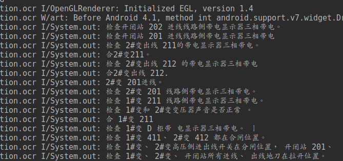

# OPENCV-NDK-OCR
* Android ocr with OpenCV and tess-two
* This project is a dead-simple which described how to build an easy offline OCR system.

## Effect Comparison
In first step, we use morphological edge detection function to drop text rects in source image.

And then, we use tess-two to identify Chinese characters and print them.

## Total Process Diagram
This diagram is a dead-simple which described how to build an easy motion identification system.

## How to use tess-two in Android
> 0.   Android Studio 3.2 or latest
> 1.   Kotlin 1.2.51 or latest
> 2.   Android SDK 28 or latest

## How to use OpenCV(Native & JAVA) in Android with Android Studio
> 0.   Android Studio 3.2 or latest
> 1.   Kotlin 1.2.51 or latest
> 2.   Android SDK 28 or latest

## Use Native Function

## Use Java Function

## Crop Mat with RotatedRect

## Cautions
> 0.   Please give this app bluetooth permission
> 1.   You may need to pair Lpms-B before open the app

## Response Data Type
* In Android source code, we use Kotlin `MutableList<LpmsData>` to save temp result.
* When the HTTP request is going to launch, we use `GSON.toJson()` function to convert temp result to formatted string.
* If you don't know how to parse JSON or unfamiliar with it, please check [JSON.org](http://www.json.org/).

## Project Dependences
The project dependences are as follows.
* [OKHTTP3](https://github.com/square/okhttp) to replace Android default HTTP client.
* [RxJava2](https://github.com/ReactiveX/RxJava) to make HTTP request and response async.
* [Retrofit2](https://github.com/square/retrofit) to build local HTTP function interface.
* [GraphView](https://github.com/jjoe64/GraphView) to show real-time data in chart.

## Usage
> 0.   Android Studio 3.2 or latest
> 1.   Kotlin 1.2.51 or latest
> 2.   Android SDK 28 or latest
> 3.   You Android phone kernal version required 21 or above
> 4.   Android Jetpack 1.0.0-beta3 or latest
