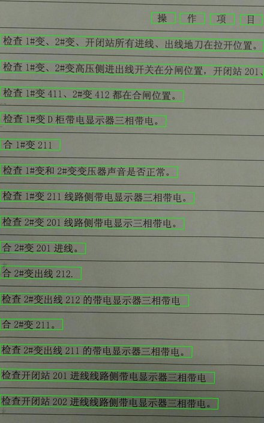

# OPENCV-NDK-OCR
* Android ocr with OpenCV and tess-two
* This project is a dead-simple which described how to build an easy off-line OCR system.

## Total Process Diagram
This diagram is a dead-simple which described how to build an easy motion identification system.

## Effect Comparison
* In first step, we use morphological edge detection function to drop text rects in source image.
* And then, we use tess-two to identify Chinese characters and print them.

## How to use tess-two in Android
Add `implementation 'com.rmtheis:tess-two:9.0.0` in your app module gradle, and use tess-two like this.

      val tessBaseAPI = TessBaseAPI()
      tessBaseAPI.init("/storage/emulated/0/", "chi_sim")
      tessBaseAPI.setImage(src)
      println(tessBaseAPI.utF8Text)
      tessBaseAPI.end()

## How to use OpenCV(Native & JAVA) in Android with Android Studio
* Follow [this link](http://dkhoa.me/post/opencv_android_studio_ndk/) to build your app with OpenCV(NDK & Java).
* Don't forget to link `jnigraphics` in `Cmake->target_link_libraries`

## Use Native Function
The native function are in the `native-lib.cpp`.

    external fun selfBinary(bitmap: Any) //gary and sobel and binary
    external fun selfDilate(bitmap: Any, p1: Int = 24, p2: Int = 3) //Dilate
    external fun selfErode(bitmap: Any, p1: Int = 30, p2: Int = 9) //Erode
    external fun selfRect(bitmap: Any) //Draw rects

## Use Java Function
Java OpenCV functions are easy to use, but it is hard to corp Mat.

    val temp = Mat()
            
    cvtColor(srcMat, temp, COLOR_RGBA2GRAY)
    Sobel(temp, temp, CV_8U, 1, 0)
    threshold(temp, temp, 0.0, 255.0, THRESH_OTSU + THRESH_BINARY)

    val element1 = getStructuringElement(MORPH_RECT, Size(30.0, 9.0))
    val element2 = getStructuringElement(MORPH_RECT, Size(24.0, 3.0))

    dilate(temp, temp, element2)
    dilate(temp, temp, element2)

    erode(temp, temp, element1) // optional

    dilate(temp, temp, element2)
    dilate(temp, temp, element2)

## Crop Mat with RotatedRect
* Follow [this link](https://blog.csdn.net/pretender05/article/details/52540513) to crop Mat.

## How to use FFMPEG in Android Studio
* Pre-build lib can be found at [here](https://github.com/wang-bin/avbuild).
* Copy them to your jnilibs dir.
* In app-build.gradle add as blow.

            android {
                   ...
                defaultConfig {
                ...
                    externalNativeBuild {
                        ndk {
                            abiFilters 'armeabi-v7a', 'arm64-v8a'
                        }
                    }
                }
                sourceSets {
                    main {
                        jniLibs.srcDirs = ['libs']
                    }
                }
            }

## Cautions
> 0.   Please give this app `WRITE_EXTERNAL_STORAGE` permission
> 1.   You may need to copy tess data to `/storage/emulated/0/tessdata`
